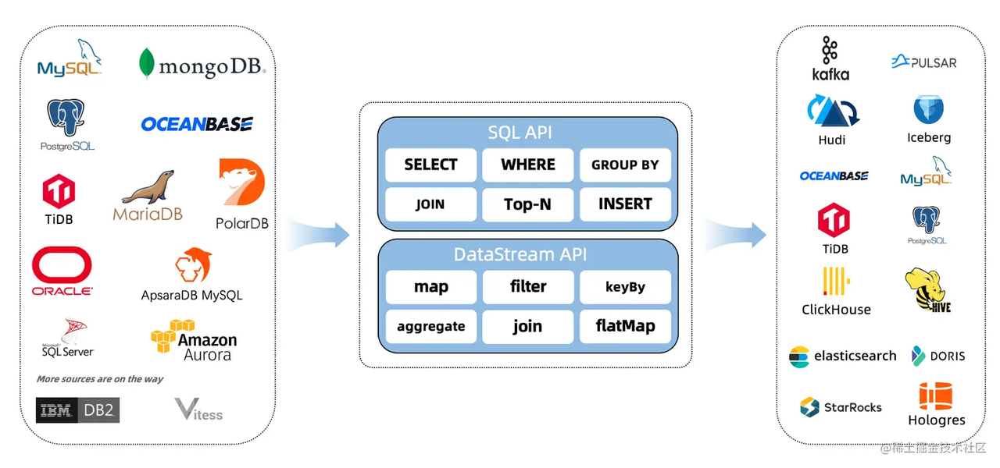

<h1 align="center">SYSU Middle Platform</h1>

<p align="center"> 
  <a href="https://github.com/LulietLyan?tab=followers">  </a>
  <a href="https://github.com/LulietLyan/Software-Engineering-Comprehensive-Training?tab=stars">  </a>
  <a href="https://github.com/LulietLyan/InterviewBasic">  </a>
</p> 

---
---

# 😀 Contents
- [😀 Contents](#-contents)
- [🤗 Introduction](#-introduction)
  - [数据同步与数据存储](#数据同步与数据存储)
    - [实现概览](#实现概览)
    - [CDC(变化数据捕获-\>数据同步)](#cdc变化数据捕获-数据同步)
    - [ElasticSearch(实时分布式搜索和分析引擎-\>数据存储)](#elasticsearch实时分布式搜索和分析引擎-数据存储)
  - [数据分析](#数据分析)
    - [Kibana(分析和可视化平台-\>数据可视化)](#kibana分析和可视化平台-数据可视化)
    - [数据同步(MySQL → MySQL)](#数据同步mysql--mysql)
    - [数据同步(MySQL → elasticsearch)](#数据同步mysql--elasticsearch)
    - [数据展示(elasticsearch → kibana)](#数据展示elasticsearch--kibana)
- [🤔 Structure](#-structure)
  - [数据库设计](#数据库设计)
  - [项目结构](#项目结构)


# 🤗 Introduction

**SYSU Middle Platform** 是一款基于 Gin-Vue 框架的简单的数据中台项目，涉及以下技术栈：


下面重点介绍数据同步与存储、数据分析方面：

## 数据同步与数据存储



### 实现概览

- 使用 **Flink CDC** 同步 MySQL 数据到 **ElasticSearch**
- 参考 [博客](https://juejin.cn/post/7142812742620020773)

### CDC(变化数据捕获->数据同步)

- [Flink CDC 文档](https://Elasticsearch.bookhub.tech/getting_started/#google_vignette)

### ElasticSearch(实时分布式搜索和分析引擎->数据存储)

- [ElasticSearch 文档](https://Elasticsearch.bookhub.tech/getting_started/#google_vignette)

## 数据分析

### Kibana(分析和可视化平台->数据可视化)

- [Kibana 文档](https://geekdaxue.co/read/kibana-doc-zh/SUMMARY.md)
- [Kibana 入门教程](https://www.cnblogs.com/chenqionghe/p/12503181.html)

### 数据同步(MySQL → MySQL)

- [JDK 安装与环境变量配置——JDK8](https://blog.csdn.net/qq_38436214/article/details/105071088)
- [源代码](https://gitee.com/xueluoye/flink-cdc-my-sql)
  - 代码
    ```java
        package com.demo.flink;

        import org.apache.flink.streaming.api.environment.StreamExecutionEnvironment;
        import org.apache.flink.table.api.bridge.java.StreamTableEnvironment;

        public class FlinkCdcMySql {
            public static void main(String[] args) {
                StreamExecutionEnvironment env = StreamExecutionEnvironment.getExecutionEnvironment();
                env.setParallelism(3);
                env.enableCheckpointing(5000);
                final StreamTableEnvironment tEnv = StreamTableEnvironment.create(env);
                String str0 = "CREATE DATABASE IF NOT EXISTS flink_source";
                tEnv.executeSql(str0);
                System.out.println("Database created");
                String str1 = "CREATE TABLE flink_source.flink_source_test (\n" +
                        "  `id` int NOT NULL COMMENT '主键',\n" +
                        "  `name` varchar(255),\n" +
                        "  `create_time` timestamp NULL,\n" +
                        "  PRIMARY KEY (`id`) NOT ENFORCED\n" +
                        ") WITH (\n" +
                        "  'connector'  = 'MySQL-cdc',\n" +
                        "  'hostname'   = '47.120.73.205',\n" +
                        "  'port'   = '3307',\n" +
                        "  'database-name'   = 'source',\n" +
                        "  'table-name' = 'test',\n" +
                        "  'username'   = 'root',\n" +
                        "  'password'   = '2024'\n" +
                        ")";
                tEnv.executeSql(str1);
                System.out.println("Source table created");
                String str2 = "CREATE TABLE flink_source.flink_target_test (\n" +
                        "  `id` int NOT NULL COMMENT '主键',\n" +
                        "  `name` varchar(255),\n" +
                        "  `create_time` timestamp NULL,\n" +
                        "  PRIMARY KEY (`id`) NOT ENFORCED\n" +
                        ") WITH (\n" +
                        "  'connector'  = 'jdbc',\n" +
                        "  'driver'     = 'com.MySQL.cj.jdbc.Driver',\n" +
                        "  'url'        = 'jdbc:MySQL://47.121.29.57:3307/flink_target',\n" +
                        "  'table-name' = '1_source_test',\n" +
                        "  'username'   = 'root',\n" +
                        "  'password'   = '654321'\n" +
                        ")";
                tEnv.executeSql(str2);
                System.out.println("Target table created");
                String str3 = "INSERT INTO flink_source.flink_target_test select * from flink_source.flink_source_test";
                tEnv.executeSql(str3);
                System.out.println("Insert statement executed");
            }
        }
    ```
- 配置
  ```xml
    <?xml version="1.0" encoding="UTF-8"?>
    <project xmlns="http://maven.apache.org/POM/4.0.0"
            xmlns:xsi="http://www.w3.org/2001/XMLSchema-instance"
            xsi:schemaLocation="http://maven.apache.org/POM/4.0.0 http://maven.apache.org/xsd/maven-4.0.0.xsd">
        <modelVersion>4.0.0</modelVersion>

        <groupId>com.demo.flink</groupId>
        <artifactId>flinkdemo</artifactId>
        <version>1.0-SNAPSHOT</version>
        <packaging>jar</packaging>

        <properties>
            <maven.compiler.source>8</maven.compiler.source>
            <maven.compiler.target>8</maven.compiler.target>
            <project.build.sourceEncoding>UTF-8</project.build.sourceEncoding>
            <flink.version>1.16.0</flink.version>
            <flink-cdc.version>2.3.0</flink-cdc.version>
        </properties>

        <dependencies>
            <dependency>
                <groupId>org.apache.flink</groupId>
                <artifactId>flink-java</artifactId>
                <version>${flink.version}</version>
            </dependency>
            <dependency>
                <groupId>org.apache.flink</groupId>
                <artifactId>flink-clients</artifactId>
                <version>${flink.version}</version>
            </dependency>
            <dependency>
                <groupId>org.apache.flink</groupId>
                <artifactId>flink-streaming-java</artifactId>
                <version>${flink.version}</version>
            </dependency>
            <dependency>
                <groupId>org.apache.flink</groupId>
                <artifactId>flink-table-api-java-bridge</artifactId>
                <version>${flink.version}</version>
            </dependency>
            <dependency>
                <groupId>org.apache.flink</groupId>
                <artifactId>flink-table-planner-loader</artifactId>
                <version>${flink.version}</version>
            </dependency>
            <dependency>
                <groupId>org.apache.flink</groupId>
                <artifactId>flink-table-runtime</artifactId>
                <version>${flink.version}</version>
            </dependency>
            <dependency>
                <groupId>org.apache.flink</groupId>
                <artifactId>flink-connector-base</artifactId>
                <version>${flink.version}</version>
            </dependency>
            <dependency>
                <groupId>org.apache.flink</groupId>
                <artifactId>flink-connector-jdbc</artifactId>
                <version>${flink.version}</version>
            </dependency>
            <dependency>
                <groupId>com.ververica</groupId>
                <artifactId>flink-sql-connector-MySQL-cdc</artifactId>
                <version>${flink-cdc.version}</version>
            </dependency>
        </dependencies>

        <build>
            <plugins>
                <plugin>
                    <groupId>org.apache.maven.plugins</groupId>
                    <artifactId>maven-jar-plugin</artifactId>
                    <version>3.2.0</version>
                    <configuration>
                        <archive>
                            <manifest>
                                <addClasspath>true</addClasspath>
                                <mainClass>com.demo.flink.FlinkCdcMySql</mainClass>
                            </manifest>
                        </archive>
                    </configuration>
                </plugin>
            </plugins>
        </build>
    </project>
  ```
- [IDEA 的 Maven 配置](https://blog.csdn.net/kkkyyy0817/article/details/136544187)
- [打包 JAVA 代码](https://blog.csdn.net/weixin_53036603/article/details/128211312)(命令行：java -cp "xxx.jar;libs/*" xxx.xxx)

### 数据同步(MySQL → elasticsearch)

- [云服务器部署 Elasticsearch](https://cloud.tencent.com/developer/article/2353806)
- flink-cdc 同步 MySQL 数据到 Elasticsearch
  - 代码
    ```java
        package com.demo.flink;

        import org.apache.flink.streaming.api.environment.StreamExecutionEnvironment;
        import org.apache.flink.table.api.bridge.java.StreamTableEnvironment;

        public class FlinkCdcMySql {
            public static void main(String[] args) {
                StreamExecutionEnvironment env = StreamExecutionEnvironment.getExecutionEnvironment();
                env.setParallelism(3);
                env.enableCheckpointing(5000);
                final StreamTableEnvironment tEnv = StreamTableEnvironment.create(env);
                String str0 = "CREATE DATABASE IF NOT EXISTS flink_source";
                tEnv.executeSql(str0);
                System.out.println("Database created");
                String str1 = "CREATE TABLE flink_source.flink_source_test (\n" +
                        "  `student_id` int,\n" +
                        "  `student_type` varchar(50),\n" +
                        "  `gender` varchar(50),\n" +
                        "  `ethnicity` varchar(50),\n" +
                        "  `birth_date` date,\n" +
                        "  `education_level` varchar(50),\n" +
                        "  `political_status` varchar(50),\n" +
                        "  `hometown` varchar(100),\n" +
                        "  `gaokao_score` int,\n" +
                        "  `grade` int,\n" +
                        "  `class` int,\n" +
                        "  PRIMARY KEY (`student_id`) NOT ENFORCED\n" +
                        ") WITH (\n" +
                        "  'connector'  = 'mysql-cdc',\n" +
                        "  'hostname'   = '47.120.73.205',\n" +
                        "  'port'   = '3307',\n" +
                        "  'database-name'   = 'source',\n" +
                        "  'table-name' = 'Student',\n" +
                        "  'username'   = 'root',\n" +
                        "  'password'   = '2024'\n" +
                        ")";
                tEnv.executeSql(str1);
                System.out.println("Source table created");

                String str2 = "CREATE TABLE flink_source.flink_target_test (\n" +
                        "  `student_id` int,\n" +
                        "  `student_type` varchar(50),\n" +
                        "  `gender` varchar(50),\n" +
                        "  `ethnicity` varchar(50),\n" +
                        "  `birth_date` date,\n" +
                        "  `education_level` varchar(50),\n" +
                        "  `political_status` varchar(50),\n" +
                        "  `hometown` varchar(100),\n" +
                        "  `gaokao_score` int,\n" +
                        "  `grade` int,\n" +
                        "  `class` int,\n" +
                        "  PRIMARY KEY (`student_id`) NOT ENFORCED\n" +
                        ") WITH (\n" +
                        "  'connector'  = 'Elasticsearch-7',\n" +
                        "  'hosts'   = 'http://47.120.73.205:9200',\n" +
                        "  'index'   = '1_source_test_index'\n" +
                        ")";
                tEnv.executeSql(str2);
                System.out.println("Target table created");

                String str3 = "INSERT INTO flink_source.flink_target_test SELECT * FROM flink_source.flink_source_test";
                tEnv.executeSql(str3);
                System.out.println("Insert statement executed");
            }
        }
    ```
  - 配置
    ```xml
        <?xml version="1.0" encoding="UTF-8"?>
        <project xmlns="http://maven.apache.org/POM/4.0.0"
                xmlns:xsi="http://www.w3.org/2001/XMLSchema-instance"
                xsi:schemaLocation="http://maven.apache.org/POM/4.0.0 http://maven.apache.org/xsd/maven-4.0.0.xsd">
            <modelVersion>4.0.0</modelVersion>

            <groupId>com.demo.flink</groupId>
            <artifactId>flinkdemo</artifactId>
            <version>1.0-SNAPSHOT</version>
            <packaging>jar</packaging>

            <properties>
                <maven.compiler.source>8</maven.compiler.source>
                <maven.compiler.target>8</maven.compiler.target>
                <project.build.sourceEncoding>UTF-8</project.build.sourceEncoding>
                <flink.version>1.16.0</flink.version>
                <flink-cdc.version>2.3.0</flink-cdc.version>
            </properties>

            <dependencies>
                <dependency>
                    <groupId>org.apache.flink</groupId>
                    <artifactId>flink-java</artifactId>
                    <version>${flink.version}</version>
                </dependency>
                <dependency>
                    <groupId>org.apache.flink</groupId>
                    <artifactId>flink-clients</artifactId>
                    <version>${flink.version}</version>
                </dependency>
                <dependency>
                    <groupId>org.apache.flink</groupId>
                    <artifactId>flink-json</artifactId>
                    <version>${flink.version}</version>
                </dependency>
                <dependency>
                    <groupId>org.apache.flink</groupId>
                    <artifactId>flink-streaming-java</artifactId>
                    <version>${flink.version}</version>
                </dependency>
                <dependency>
                    <groupId>org.apache.flink</groupId>
                    <artifactId>flink-table-api-java-bridge</artifactId>
                    <version>${flink.version}</version>
                </dependency>
                <dependency>
                    <groupId>org.apache.flink</groupId>
                    <artifactId>flink-table-planner-loader</artifactId>
                    <version>${flink.version}</version>
                </dependency>
                <dependency>
                    <groupId>org.apache.flink</groupId>
                    <artifactId>flink-table-runtime</artifactId>
                    <version>${flink.version}</version>
                </dependency>
                <dependency>
                    <groupId>org.apache.flink</groupId>
                    <artifactId>flink-connector-base</artifactId>
                    <version>${flink.version}</version>
                </dependency>
                <dependency>
                    <groupId>org.apache.flink</groupId>
                    <artifactId>flink-connector-jdbc</artifactId>
                    <version>${flink.version}</version>
                </dependency>
                <dependency>
                    <groupId>com.ververica</groupId>
                    <artifactId>flink-sql-connector-mysql-cdc</artifactId>
                    <version>${flink-cdc.version}</version>
                </dependency>
                <dependency>
                    <groupId>org.apache.flink</groupId>
                    <artifactId>flink-connector-elasticsearch7</artifactId>
                    <version>${flink.version}</version>
                </dependency>
            </dependencies>

            <build>
                <plugins>
                    <plugin>
                        <groupId>org.apache.maven.plugins</groupId>
                        <artifactId>maven-jar-plugin</artifactId>
                        <version>3.2.0</version>
                        <configuration>
                            <archive>
                                <manifest>
                                    <addClasspath>true</addClasspath>
                                    <mainClass>com.demo.flink.FlinkCdcMySql</mainClass>
                                </manifest>
                            </archive>
                        </configuration>
                    </plugin>
                </plugins>
            </build>
        </project>
    ```
  - 测试
    - [查看索引内容](http://47.120.73.205:9200/索引名/_search?pretty)
    - [查看索引列表](http://47.120.73.205:9200/_cat/indices?v)
- Elasticsearch 删除索引
  - 代码
    ```java
        package com.demo.flink;

        import org.apache.http.HttpHost;
        import org.apache.http.client.config.RequestConfig;
        import org.apache.http.client.methods.CloseableHttpResponse;
        import org.apache.http.client.methods.HttpDelete;
        import org.apache.http.impl.client.CloseableHttpClient;
        import org.apache.http.impl.client.HttpClients;
        import org.apache.http.util.EntityUtils;

        public class FlinkCdcMySql {
            public static void main(String[] args) throws Exception {
                // Elasticsearch集群地址
                HttpHost httpHost = new HttpHost("47.120.73.205", 9200, "http");
                // 创建HttpClient对象
                CloseableHttpClient httpClient = HttpClients.custom().build();
                try {
                    // 创建DELETE请求
                    HttpDelete httpDelete = new HttpDelete("/1_source_test_index");
                    RequestConfig requestConfig = RequestConfig.custom().setConnectTimeout(1000).setSocketTimeout(1000).build();
                    httpDelete.setConfig(requestConfig);
                    // 执行请求
                    CloseableHttpResponse response = httpClient.execute(httpHost, httpDelete);
                    // 检查响应状态
                    if (response.getStatusLine().getStatusCode() == 200) {
                        System.out.println("Index deleted successfully");
                    } else {
                        System.out.println("Failed to delete index");
                    }
                    EntityUtils.consume(response.getEntity());
                } finally {
                    // 关闭httpClient
                    httpClient.close();
                }
            }
        }
    ```
- [云服务器部署 Kibana、界面中文显示](https://cloud.tencent.com/developer/article/2353806)


### 数据展示(elasticsearch → kibana)

- [Kibana 使用教程](https://www.cnblogs.com/chenqionghe/p/12503181.html)

# 🤔 Structure

## 数据库设计

| Column Name | Data Type | Description | Key | Foreign Key | Length |
|:------------:|:-----------:|:-------------:|:-----:|:-------------:|:--------:|
| U_uid | int | 分析用户对应的基本账号信息 |  | User.U_uid | 64 |
| AU_uid | int | 分析用户的编号 | Key |  |  |
| AU_phone | varchar | 分析用户的联系电话 |  |  | 20 |
| AU_std_uid | varchar | 分析用户的学号 |  |  | 20 |
| AU_email | varchar | 分析用户的邮箱 |  |  | 128 |
| AU_realname | varchar | 分析用户的真实姓名 |  |  | 64 |
| U_uid | int | 分析用户对应的基本账号信息 |  | User.U_uid | 64 |
| PU_uid | int | 项目用户的编号 | Key |  |  |
| PU_description | varchar | 项目简介 |  |  | 8192 |
| PU_write_url | varchar | 对项目私有数据写入的api路径 |  |  | 512 |
| PU_logo_url | varchar | 项目logo图片的存储路径 |  |  | 1024 |
| PU_email | varchar | 项目的邮箱 |  |  | 128 |
| PT_name | varchar | 项目私有数据同步后的数据表名（在中台中的名称而不是项目服务器中的名称） |  |  | 64 |
| PT_uid | int | 项目私有数据同步后的数据表编号 | Key |  |  |
| PT_description | varchar | 数据表描述 |  |  | 8192 |
| create_at | datatime | 创建时间 |  |  |  |
| PT_remote_db_name(new) | varchar | 数据源的库名，在跨项目写入时作为转发请求的一部分 |  |  | 64 |
| PT_remote_table_name(new) | varchar | 数据源的表名，在跨项目写入时用于翻译表名 |  |  | 64 |
| PU_uid | int | 属于哪个项目，外键，在跨项目写入时用于寻找对应项目的配置（写入api的url等） |  | ProjectUser.PU_uid |  |
| PT_remote_hostname | varchar | 数据源的主机ip |  |  | 64 |
| PT_remote_username | varchar | 数据源的主机用户名 |  |  | 64 |
| PT_remote_password | varchar | 数据源的密码 |  |  | 64 |
| PT_remote_port | int | 数据源的mysql端口 |  |  | 64 |
| PU_uid | int | 持有权限的项目用户的编号 |  | ProjectUser.PU_uid |  |
| PT_uid | int | 目标数据表的编号 |  | ProjectTable.PT_uid |  |
| P_level | int | 1-只读，2-读写 |  |  |  |
| P_uid | int | 权限记录的编号 | Key |  |  |
| DPU_phone | varchar | 钉钉关联的电话 |  |  | 20 |
| DPU_uid | int | 钉钉记录的编号 | Key |  |  |
| PU_uid | int | 对应的项目编号 |  | ProjectUser.PU_uid |  |
| PM_uid | int | 对应的项目成员的编号 |  | ProjectMember.PM_uid |  |
| DAU_phone | varchar | 钉钉关联的电话 |  |  | 20 |
| DAU_uid | int | 钉钉记录的编号 | Key |  |  |
| AU_uid | int | 对应的分析用户的编号 |  | AnalyticalUser.AU_uid |  |
| N_uid | int | 通知的编号 | Key |  |  |
| N_type | int | 1-所有项目用户，2-所有分析用户，3-所有项目用户和分析用户，4-特定项目用户，5-特定分析用户 |  |  |  |
| PU_uid | int | 如果N_type==4，则是目标项目用户的编号 |  | ProjectUser.PU_uid |  |
| AU_uid | int | 如果N_type==5，则是目标分析用户的编号（User表而不是AU表） |  | AnalyticalUser.AU_uid |  |
| N_Title | varchar | 通知的标题 |  |  | 256 |
| N_Body | varchar | 通知的正文 |  |  | 8192 |
| PU_uid | int | 发起请求的项目用户的编号 |  | ProjectUser.PU_uid |  |
| PT_uid | int | 请求的同步后的数据表 |  | ProjectTable.PT_uid |  |
| PR_level | int | 请求的权限等级1-只读，2-读写 |  |  |  |
| PR_status | int | 请求的状态1-正在请求，2-已通过，3-已拒绝 |  |  |  |
| PR_uid | int | 权限请求的编号 | Key |  |  |
| A_url | varchar | 中台提供的api的路径（中台要求实现的api则此字段为空） |  |  | 1024 |
| A_uid | int | api的编号 | Key |  |  |
| A_parameter | varchar | json编码的参数示例，可以用非json文本辅助描述 |  |  | 5000 |
| A_respond | varchar | json编码的返回实例，可以用非json文本辅助描述 |  |  | 5000 |
| A_description | varchar | 中台对API的描述 |  |  | 2048 |
| A_type | int | 1-中台提供的api，2-中台要求实现的api(其实就是写入私有数据的api)，3-用户提供的 |  |  |  |
| A_name | varchar | api的名称 |  |  |  |
| PU_uid | int | 提供api的用户主键（A_type==3时有效） |  |  |  |
| AC_code | varchar | 激活码内容 |  |  | 256 |
| AC_usable | int | 是否可用(1--true,0--false) |  |  |  |
| AC_type | int | 1-项目用户端可用，2-分析用户端可用，3-管理端可用 |  |  |  |
| AC_uid | int | 主键 | Key |  |  |
| PM_uid | int | 项目成员的编号 | Key |  |  |
| PM_name | varchar | 项目成员的姓名 |  |  | 64 |
| PM_phone | varchar | 项目成员内的联系电话 |  |  | 20 |
| PM_email | varchar | 项目成员的邮箱 |  |  | 128 |
| PU_uid | int | 所属项目的编号 |  | ProjectUser.PU_uid |  |
| PM_position | varchar | 职务 |  |  | 64 |
| U_password | varchar | 密码 |  |  |  |
| U_username | varchar | 用户名 |  |  |  |
| U_type | int | 类型，1-开发端，2-分析端，3-管理端 |  |  |  |
| U_uid | int | 主键 | Key |  |  |
| U_mysqlUserName | varchar | 用户在中台MySQL的用户名 |  |  |  |
| U_mysqlUserPwd | varchar | 用户在中台MySQL的密码 |  |  |  |

## 项目结构

- **config**：配置文件
- **control**：API 对应的 Handler
- **flink_libs**：Flink 链接文件
- **image**：图片
- **logic**：JWT 鉴权机制
- **models**：结构体等数据结构的定义
- **mysql**：控制 MySQL 的连接
- **response**；包装响应函数
- **router**：定义路由
- **session**：输出 SQL 解析结果
- **SQLParser**：简单的 SQL 编译器
- **types**：SQL 语法树的各种封装类与方法
- **utils**：工具类，包括字符串、时间处理等